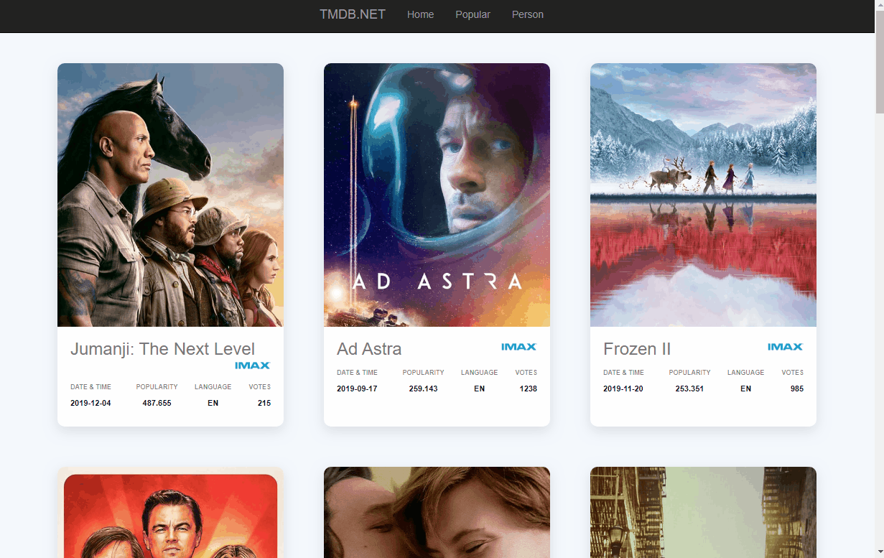

# TMDB.net
I have developed a **TMDB wrapper**  using Asp.NET MVC 5 
This is a web application with a two main view areas (2 pages) for viewing popular movies and
movie specific information. 

The **Home** page view contains a list of all pupular movies. 
The movie **Details** page contains movie specific information for each movie. 

For navigating to the movie specific page the user is supose to click on each movie title or image from the **Home** page.

The movie **Details** page contains a **Back** button at the bottom line, that takes the user back to the **Home** page.

I have also implemented a **Pager** at the bottom of the **Home** page. 

I am  using Visual Studio 2017. 

All information is provided from the TMDB: https://www.themoviedb.org/

To get the source code and run this project please clone: https://github.com/zachion/TMDB.net

Developed by @Zach Ioannou - 2019
